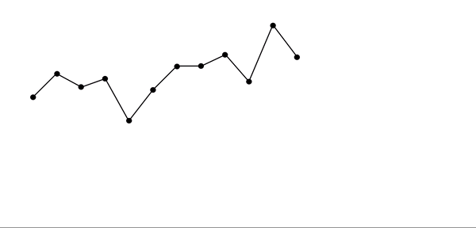
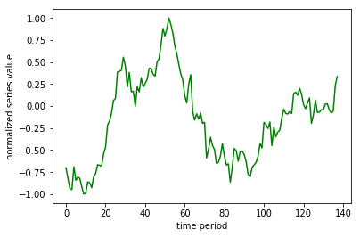
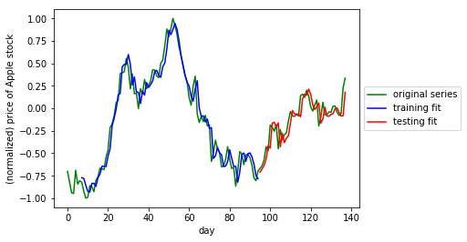
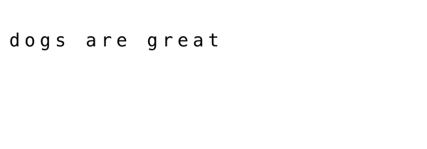
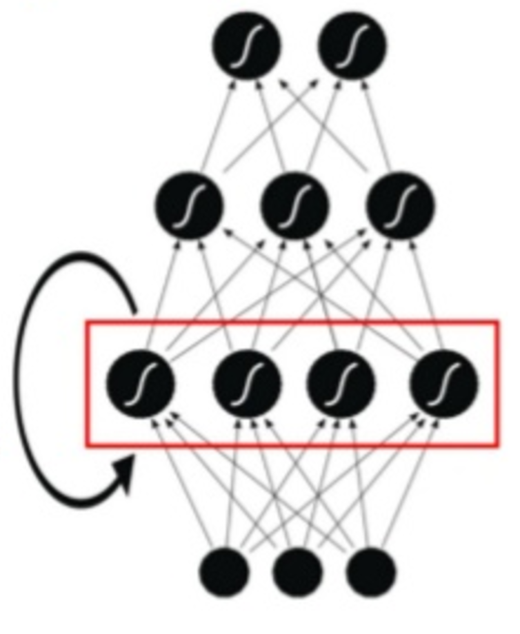

# Time Series Prediction & Text Generation with a Recurrent Neural Network

An LSTM-based recurrent neural network built from scratch with Keras, applied to two different sequence problems:

1. **Time series regression** — predicting future Apple stock prices from past values.
2. **Text generation** — training a character-level language model on Sir Arthur Conan Doyle's *The Adventures of Sherlock Holmes* to generate new, Holmes-style text.

Both problems are solved with the same core idea: slide a fixed-size window over a sequence to turn it into supervised input/output pairs, then let an LSTM learn the pattern.

## Contents

- [Repository structure](#repository-structure)
- [Setup](#setup)
- [Part 1 — Time series prediction](#part-1--time-series-prediction)
- [Part 2 — Text generation](#part-2--text-generation)
- [Bonus: applying the pipeline to a new series](#bonus-applying-the-pipeline-to-a-new-series)
- [Credits](#credits)

## Repository structure

```
.
├── my_answers.py                # Core implementation: windowing functions + both RNN architectures
├── RNN_project.ipynb            # Main notebook — runs both Part 1 and Part 2 end to end
├── RNN_project.html             # Static rendered export of the executed notebook
├── RNN_test.py / RNN_Test.ipynb # Scratch exploration script/notebook (see Bonus section)
├── datasets/                    # Input data: Apple stock prices, QQQ prices, Sherlock Holmes text, ...
├── model_weights/               # Saved Keras weights (.hdf5) for each trained model
├── images/                      # Diagrams and animations used to explain the method below
│   └── archive/                 # Unused reference images carried over from the course starter kit
├── results/                     # Actual output plots and generated-text samples from this project
├── requirements.txt
└── environment_setup_instructions.txt
```

## Setup

```bash
pip install -r requirements.txt
```

This project was built against older pinned versions (Keras 2.0.2, TensorFlow 1.2.0, Python 3), so it's best run in a dedicated virtual environment — see `environment_setup_instructions.txt` for GPU/EC2 notes if you want to retrain rather than just read the results.

## Part 1 — Time series prediction

**Goal:** given a window of the last `T` normalized Apple stock prices, predict the next one.

**How the data is prepared** — `window_transform_series()` in `my_answers.py` slides a window of size `T` across the series, producing one input/output pair per step:

<p align="center">
  
</p>

**Model** — a single-layer LSTM (5 hidden units) followed by a dense output layer, trained with mean squared error:

```python
def build_part1_RNN(window_size):
    model = Sequential()
    model.add(LSTM(5, input_shape=(window_size, 1)))
    model.add(Dense(1))
    return model
```

**Results**

The raw (normalized) input series being modeled:

<p align="center">
  
</p>

Model predictions on both the training and held-out testing windows, plotted against the true series:

<p align="center">
  
</p>

| Metric | MSE |
|---|---|
| Training error | 0.0150 |
| Testing error | 0.0149 |

Training and testing error land within a hair of each other, and the testing-fit (red) tracks the true series (green) closely through the last third of the data it never trained on — the model generalized rather than just memorizing the training window.

## Part 2 — Text generation

**Goal:** given the last 50 characters of text, predict the next character — then chain predictions together to generate whole passages.

**Preprocessing:** the raw Sherlock Holmes text is lowercased and stripped down to 33 unique symbols (26 letters, space, and `! , . : ; ?`), then windowed the same way as Part 1, but over characters and one-hot encoded per character:

<p align="center">
  
</p>

**Model** — a single-layer LSTM (200 hidden units) followed by a dense + softmax layer over the 33-character vocabulary, trained with categorical cross-entropy as a multiclass classification problem (one class per possible next character):

```python
def build_part2_RNN(window_size, num_chars):
    model = Sequential()
    model.add(LSTM(200, input_shape=(window_size, num_chars)))
    model.add(Dense(num_chars))
    model.add(Activation('softmax'))
    return model
```

<p align="center">
  
</p>

**Results** — the model was trained twice, on progressively more data, to see how sample size affects output quality:

| Training run | Training examples | Epochs | Loss: first → last epoch |
|---|---|---|---|
| Small | 10,000 | 40 | 3.04 → 1.80 |
| Large | 100,000 | 30 | 2.01 → 1.01 |

Generated text, seeding the trained model with a real sentence from the book and letting it predict the next 50 characters on its own (`|` marks where the seed ends and the model takes over):

**Small model** (from [`results/text_generation_small_model_samples.txt`](results/text_generation_small_model_samples.txt)):
```
the door. then there was a loud and authoritative| whith whe hare he mand dour mas the wist out was
tap. come in! said holmes. a man entered who coul|d he was the cous the mas the wain how so bent out
```

**Large model** (from [`results/text_generation_large_model_samples.txt`](results/text_generation_large_model_samples.txt)):
```
. then, suddenly realising the full purport of his| father i saw it. they are the den case sut entlee
words, she gave a violent start and looked up, wi|th the streets, and there is a strent of a grie to
notice the carriage go up any. come, cried the inspector, laughing; its a very pretty diversity of o|thers. and the evering a small bearine it allars where are remarked hor had been day no tonsing that
```

Ten times the training data roughly halves the loss and visibly improves fluency — the large model strings together plausible word fragments and even a few complete real words ("father", "saw", "streets"), while the small model is closer to phonetic noise. Neither has seen enough data or capacity to produce fully grammatical prose (that would need a bigger model and much more training), but the improvement from small → large data clearly shows the model is learning real structure in the language, not just overfitting noise.

## Bonus: applying the pipeline to a new series

`RNN_test.py` / `RNN_Test.ipynb` reuse the exact same `my_answers.py` windowing and model-building code from Part 1, but point it at `datasets/qqq_prices.csv` instead of Apple — a quick sanity check that the approach generalizes to a different stock/ETF without changing any of the modeling code, only the input data.

## Credits

Originally built as the Recurrent Neural Networks project for Udacity's Artificial Intelligence Nanodegree. Course-provided starter code, diagrams, and datasets are credited to Udacity; `my_answers.py`, the QQQ extension, and this README's writeup and results are the author's own work.
